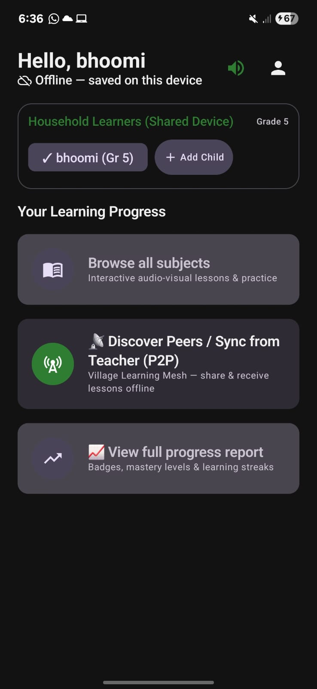
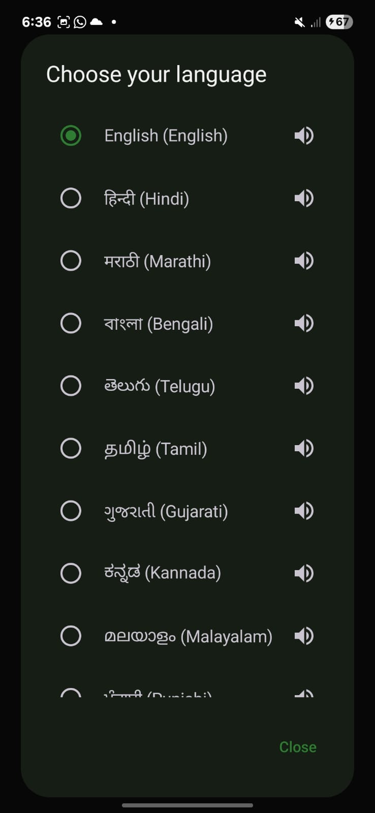
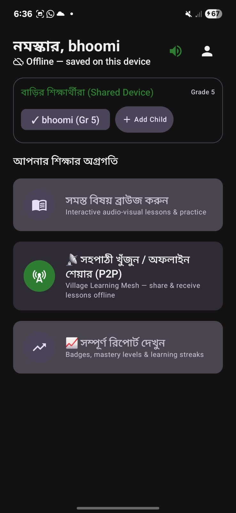
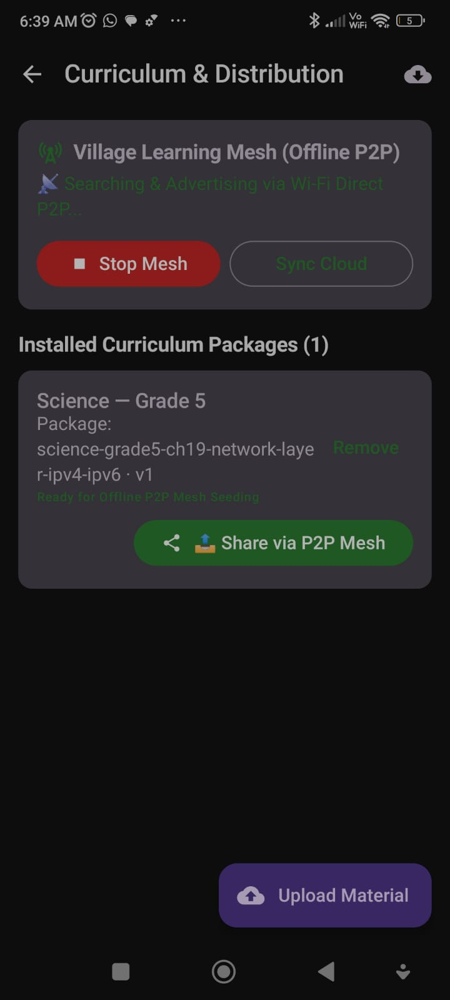
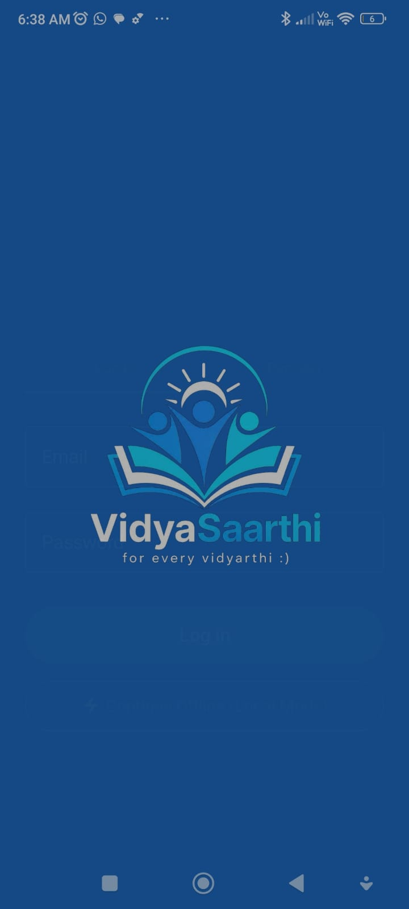
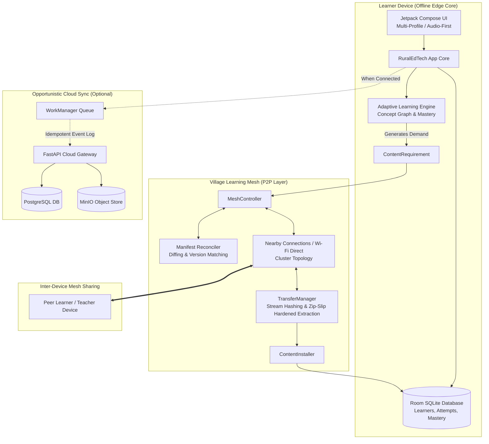

<div align="center">


# VidyaSaarthi (विद्यासारथी)
### *For Every Vidyarthi :)*
**Offline-First, Self-Adapting Educational Mesh & Portable Learning Ecosystem for Rural India**

[](https://developer.android.com/)
[](https://kotlinlang.org/)
[](https://developer.android.com/jetpack/compose)
[](https://fastapi.tiangolo.com/)
[](LICENSE)

---
*Developed for MUJ HACKX 4.0 — PS #4: Accessible Education for Rural India (EdTech)*

</div>

---

## 📌 Executive Summary

Digital education commonly assumes high-speed 4G/5G connectivity, personal dedicated devices, high processing power, and English literacy. In rural and remote Indian villages, **none of these hold**:
- Networks are intermittent, weak, or completely unavailable.
- Multiple siblings share a single low-spec household smartphone.
- Children learn and internalize concepts best in their native regional mother tongue.
- Parents often have low digital literacy, making text-dense UI unusable.

**VidyaSaarthi** flips the paradigm: **The internet is an accelerator, not a dependency.** 

The learner’s device operates as a fully capable, autonomous edge-learning computer. Nearby phones autonomously form a **Village Learning Mesh** (a decentralized, store-and-forward peer-to-peer distribution network) over local Wi-Fi/Bluetooth radios without internet, while learner progress remains completely independent of the physical device via an encrypted **Portable Learning Passport**.

---

## 📸 App Showcase

<div align="center">
<table>
  <tr>
    <td align="center" width="33%">
      <br/>
      <b>Offline Shared-Device Home (English)</b><br/>
      <i>Logical multi-learner profiles & 1-tap P2P access</i>
    </td>
    <td align="center" width="33%">
      <br/>
      <b>Audio-Assisted Language Picker</b><br/>
      <i>10+ Indic languages with spoken previews</i>
    </td>
    <td align="center" width="33%">
      <br/>
      <b>Deep Regional Localization (Bengali)</b><br/>
      <i>Interface, audio explanations & quizzes fully localized</i>
    </td>
  </tr>
  <tr>
    <td align="center" colspan="2">
      <br/>
      <b>Village Learning Mesh (Curriculum Seeding & P2P)</b><br/>
      <i>Autonomous local discovery, package seeding, and delta distribution</i>
    </td>
    <td align="center">
      <br/>
      <b>VidyaSaarthi Splash</b><br/>
      <i>Lightweight, battery-efficient edge architecture</i>
    </td>
  </tr>
</table>
</div>

---

## 🌟 Core Innovations & USPs

### 1. Village Learning Mesh (Autonomous Offline CDN)
Nearby student and teacher devices autonomously form a store-and-forward distribution network using Google Nearby Connections (abstracting Wi-Fi Direct, Bluetooth, and BLE):
- **O(1) Manifest Reconciliation:** Devices exchange lightweight JSON manifests (`ContentManifest`) containing package IDs, semantic versions, and SHA-256 hashes instead of blindly transferring files.
- **Demand-Driven Content Routing:** If an edge adaptive engine flags a weakness in a topic (e.g., `fractions-remedial-v2`), the mesh automatically broadcasts a targeted `P2PMessage.Request` to connected peers.
- **Store-and-Forward Propagation:** When Student A receives a curriculum package from a teacher, Student A's node automatically marks it as redistributable and serves it to Student B later in the village—without any internet or central server involved.

### 2. Edge Adaptive Learning Engine (Zero Cloud Dependencies)
A fully deterministic knowledge-tracing engine running directly on-device using Room SQLite:

$$\text{Mastery} = 0.50 \cdot \text{Accuracy} + 0.25 \cdot \text{RecentAccuracy} + 0.15 \cdot \text{DifficultyFactor} + 0.10 \cdot \text{Consistency}$$

- Dynamically classifies learners into **Beginner (<0.40)**, **Developing (0.40–0.69)**, **Proficient (0.70–0.84)**, and **Mastered (0.85–1.00)**.
- Automatically adjusts question difficulty, schedules remedial lessons, and emits `ContentRequirement` packages without calling remote LLMs or cloud endpoints.

### 3. Portable Learning Passport (Decentralized Identity)
Progress belongs to the child, not the hardware. 
- A student sharing a parent's phone can export their complete learning history, badges, and mastery graphs into an encrypted **Learning Passport**.
- **Hardware-Agnostic Cryptography:** Secured with **AES-256-GCM** using PBKDF2 key derivation from a user-selected 4-digit PIN with a random 16-byte cryptographically secure salt. This allows seamless profile restoration on a different smartphone or school tablet completely offline.

### 4. Low-Literacy & Multilingual First
- Built-in support for major Indian languages (Hindi, Marathi, Bengali, Telugu, Tamil, Gujarati, Kannada, Malayalam, Punjabi, English).
- Audio narration for every question, lesson block, and navigation control using Android TTS and packaged Opus/WebP media assets.
- Voice-assisted intent navigation (`START_LESSON`, `EXPLAIN_AGAIN`, `REPEAT`, `HELP`).

### 5. Opportunistic Cloud Synchronization
When an internet connection appears (e.g., at a weekly village market or school Wi-Fi), Android `WorkManager` activates an event-driven sync queue to ingest telemetry into the FastAPI/PostgreSQL backend while downloading newly published master curriculum packages.

---

## 🏛 System Architecture



---

## 📂 Repository Structure

```text
hackx-rural-edtech-android/
├── app/
│   ├── src/main/
│   │   ├── AndroidManifest.xml          # Permissions (Nearby Wi-Fi, Bluetooth, Location)
│   │   └── java/com/hackx/ruraledtech/
│   │       ├── core/                    # DI (Hilt), Audio, Connectivity, Device ID, WorkManager
│   │       ├── data/                    # Content package loaders, Room SQLite DAOs & DB, mappers
│   │       ├── domain/                  # Use cases, models (Learner, Concept, Mastery, Content)
│   │       ├── feature/                 # Jetpack Compose features
│   │       │   ├── accessibility/       # Voice & font scale options
│   │       │   ├── contentlibrary/      # Offline downloaded curriculum browser
│   │       │   ├── home/                # Adaptive dashboard & quick-action cards
│   │       │   ├── learner/             # Shared-device profile selector
│   │       │   ├── lessons/             # Multilingual lesson viewers
│   │       │   ├── passport/            # Export/Import encrypted learning passport
│   │       │   ├── quiz/                # Assessment engine with instant local feedback
│   │       │   └── teacher/             # Local offline teacher group & analytics view
│   │       ├── p2p/                     # Group 3 P2P Mesh Subsystem
│   │       │   ├── connection/          # NearbyConnectionManager wrapper & listeners
│   │       │   ├── manifest/            # ContentManifest & O(1) ManifestReconciler
│   │       │   ├── mesh/                # MeshController, StateFlow observables
│   │       │   ├── passport/            # PBKDF2/AES-GCM Passport Crypto & Transfer
│   │       │   ├── protocol/            # Sealed P2PMessage hierarchy & Serializer
│   │       │   └── transfer/            # TransferManager, PackageVerifier, Zip-Slip check
│   │       └── ui/theme/                # Colors, Typography & Material3 Design System
├── backend/                             # Optional Teacher & Cloud Synchronization Gateway
│   ├── app/                             # FastAPI API endpoints (auth, classes, content, sync)
│   ├── alembic/                         # Database migrations
│   ├── docker-compose.yml               # PostgreSQL + MinIO + FastAPI containerization
│   └── requirements.txt
├── demo-content/                        # Pre-packaged curriculum packages (.zip format)
│   ├── math-grade5-decimals/            # Manifest, checksums, bilingual lessons & questions
│   └── science-grade5-water-cycle/      # Audio-visual curriculum assets
└── README.md
```

---

## 🔒 Security & Edge Hardening

**Path-Traversal ("Zip-Slip") Protection:**
When unpacking `.pkg` / `.zip` curriculum archives over the air, the unzipper enforces canonical directory verification with strict file-separator boundaries:
```kotlin
if (!destFile.canonicalPath.startsWith(targetDir.canonicalPath + File.separator)) {
    throw SecurityException("Zip-Slip path traversal vulnerability detected!")
}
```

**Buffer-Safe Cryptographic Verification:**
SHA-256 checksums are calculated using chunked 8KB streams on `Dispatchers.IO` to prevent `OutOfMemoryError` crashes on 1GB/2GB RAM entry-level Android devices.

**Decentralized Zero-Trust Passports:**
Passports avoid device-locked keys by utilizing PBKDF2 with 10,000 iterations over a user-selected 4-digit PIN, ensuring sensitive educational records can only be decrypted by the child or parent.

---

## 🛠 Tech Stack

| Domain | Technologies / Libraries |
| :--- | :--- |
| **Mobile OS** | Android (Min SDK: 24, Target SDK: 34) |
| **Language & UI** | Kotlin 1.9+, Jetpack Compose, Material3 |
| **Architecture** | Clean Architecture + MVVM, Unidirectional Data Flow (UDF) |
| **Local Storage** | SQLite via Room, Androidx DataStore Preferences |
| **Dependency Injection** | Dagger Hilt |
| **P2P Networking** | Google Play Services Nearby Connections (Cluster Strategy) |
| **Serialization** | Kotlinx Serialization (Polymorphic JSON protocol) |
| **Cryptography** | `javax.crypto` (AES/GCM/NoPadding, PBKDF2WithHmacSHA256) |
| **Backend API** | Python 3.11, FastAPI, Pydantic v2, SQLAlchemy, Alembic |
| **Cloud Storage** | PostgreSQL (Metadata/Events), MinIO (S3-compatible Object Storage) |

---

## 🚀 Getting Started

### Prerequisites
- Android Studio Iguana / Jellyfish or newer.
- Android SDK 34 & JDK 17.
- Two or more physical Android phones (recommended for testing Nearby Connections mesh).

### 1. Build & Run the Android Application
Clone the repository:
```bash
git clone [https://github.com/apoorva-6575/hackx-rural-edtech-android.git](https://github.com/apoorva-6575/hackx-rural-edtech-android.git)
cd hackx-rural-edtech-android
```
- Open the project in Android Studio.
- Let Gradle sync dependencies.
- Connect an Android device with Developer Options and USB Debugging enabled.
- Grant the runtime permissions when prompted (Nearby Devices, Bluetooth, and Location).

### 2. (Optional) Run the Central Backend
```bash
cd backend
docker-compose up --build -d
```
The FastAPI documentation will be accessible locally at `http://localhost:8000/docs`.

---

## 🧪 Testing the Mesh Offline (Demo Steps)

```text
[Teacher Device] (Has Science Chapter 19 Package)
       │
       ▼ (Share via P2P Mesh)
[Student Device A] (Receives, verifies SHA-256, auto-installs into Room DB)
       │
       ▼ (Walks away; Teacher turns off app)
[Student Device B] (Needs Science Chapter 19)
       │
       ▼ (Discovers Student A -> Reconciles Manifests -> Transfers directly)
[Student Device B Completes Lesson Completely Disconnected]
```

1. Launch the app on **Phone A** and **Phone B**.
2. Turn **Off** Mobile Data and Wi-Fi internet connectivity on both phones.
3. On **Phone A** (Teacher/Seed device): Navigate to **Curriculum & Distribution** $\rightarrow$ tap **Start Mesh** $\rightarrow$ tap **Share via P2P Mesh**.
4. On **Phone B** (Student device): Tap **Discover Peers / Sync (P2P)**.
5. Observe manifest negotiation, SHA-256 verification, and automatic curriculum installation.

---

## 👥 Engineering Pods

- **Group 1 (Core & UI):** Modular Jetpack Compose UI, Room SQLite persistence, multi-learner profile management, and low-literacy ergonomics.
- **Group 2 (Learning Intelligence):** Knowledge tracing graph, rule-based adaptive mastery computation, and multilingual audio speech parser.
- **Group 3 (P2P Mesh & Identity):** Distributed Nearby Connections cluster transport, manifest diffing, store-and-forward routing, and encrypted Learning Passports.
- **Group 4 (Sync & Infrastructure):** Event-driven sync queues, FastAPI backend, Docker deployment, and MinIO content hosting.

---
